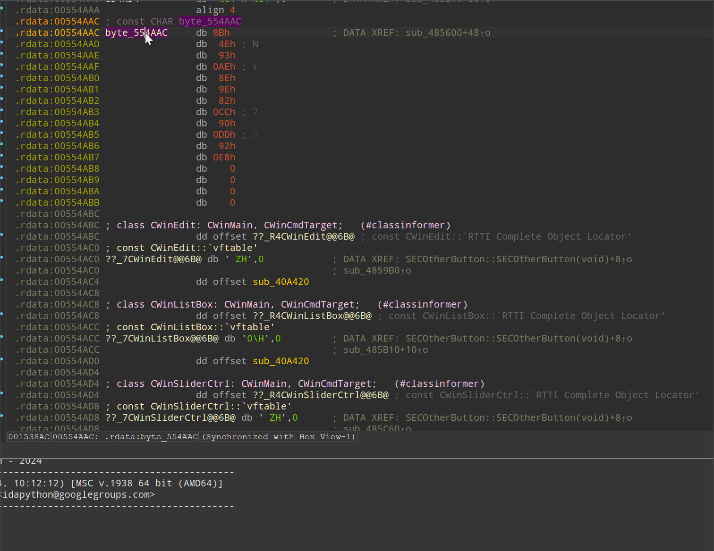

# StrConv

An IDA Pro plugin to convert bytes to selected string type.

Compatible with IDA 9.1.

## Installation

Download the latest .py file and place it in the `plugins` directory of your IDA installation.

## Usage

- To convert bytes to a string, right-click on the bytes in the disassembly view, select `Convert bytes to` from the context menu, and choose the desired string type.
- To convert all bytes in .rdata section to strings, right-click anywhere in the disassembly view, select `Convert all bytes to` from the context menu, and choose the desired string type.

## Notes

- To change the default encoding for every type, go to `Options` -> `General` -> `Strings` and change the settings.
- If you are not satisfied with the result, you can select all the bytes you'd like to convert and press `A`.
